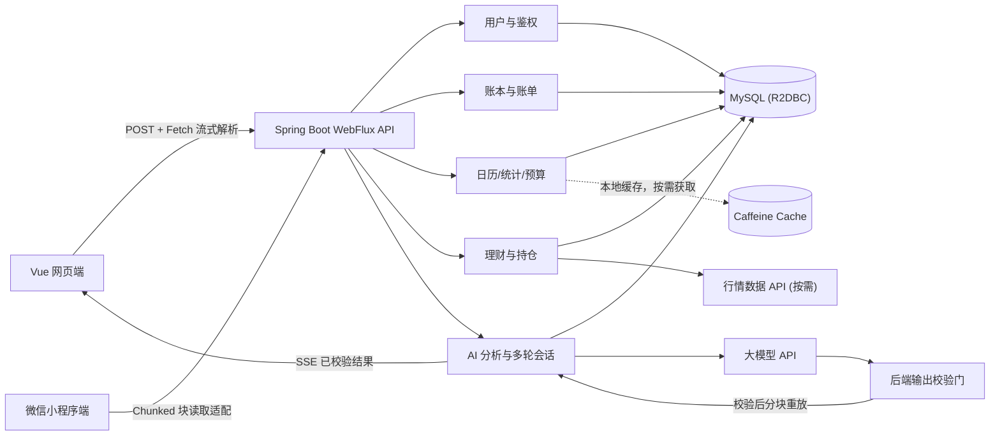

# 钱迹后端与数据库架构分析

> 状态：架构基线已落地，P0 核心记账链路联调收口中
>
> 日期：2026-07-13
> 范围：后端、数据库、AI 与理财数据边界；实现进度以交接摘要、操作记录、代码和测试为准。

## 一、目标与假设

### 核心目标

围绕用户最常用的链路建立第一版后端：

```text
登录 → 记一笔 → 查看当天明细 → 查看月历 → 查看统计与预算 → 获取 AI 自动分析
```

理财与 AI 多轮对话链路（后续版本引入）：

```text
多轮会话列表 → 新建/删除会话 → 沉浸式 AI 对话与财务记忆
理财分类 → 产品列表 → 产品详情/行情 → 用户持仓 → AI 风险辅助说明
```

### 当前假设

1. 后端采用 Java 21、Spring Boot 3 WebFlux、Spring Data R2DBC、MySQL 8。
2. 彻底移除运行时阻塞的 JDBC / MyBatis-Plus。Flyway 可以继续使用 JDBC，但仅在启动阶段执行数据迁移，不占用运行时 Netty 事件线程。
3. 第一版是模块化单体，不拆微服务。
4. 缓存采用本地内存缓存 Caffeine，多实例部署前暂不引入 Redis；消息队列和对象存储仅在实际场景需要时引入。
5. AI 与行情供应商通过适配器接入，业务层不绑定具体厂商。
6. 网页端使用 Vue 3；微信小程序通过同一套 REST API 接入，具体传输层由于 SSE 差异需在客户端做适配兼容。

## 二、总体架构



## 三、后端模块边界

| 模块 | 核心职责 | 明确不负责 |
|---|---|---|
| `auth` | 登录（用户名密码/微信）、令牌、当前用户、设备会话 | 账单业务 |
| `user` | 用户资料、隐私偏好、AI 授权、销户清理 | 密码明文保存 |
| `ledger` | 账本、账户（保存余额快照）、分类、标签、账单增删改查、单流水转账 | 统计图形渲染 |
| `report` | 日历汇总、日/周/月/年统计、分类占比、趋势 | 修改原始账单 |
| `budget` | 月预算、分类预算、使用进度、超支状态 | 推送渠道实现 |
| `wealth` | 产品分类、产品资料、持仓、按需产品行情快照 | 购买、赎回、资金转移与全市场高频采集 |
| `ai` | 场景单次分析、模型适配、输出校验门、校验后流式重放、会话管理和合规审核 | 核心金额计算、权限决策与模型原文透传 |
| `notification` | 记账、预算、还款提醒计划 | 第一版实时消息基础设施 |
| `admin` | 分类模板、公告、运营统计 | 直接查看用户敏感账单明细 |

## 四、核心业务链路

### 1. 登录与数据隔离

1. 客户端提交登录凭据。
   * **P0**：用户名 / 密码登录，方便网页联调。
   * **P1**：微信登录与手机号绑定。
   * **后置**：短信验证码登录（待确认短信资质和成本后接入）。

### 2. 记一笔与账户余额

1. 校验金额、发生时间、账户、分类和账本归属。金额使用 `DECIMAL`，禁止浮点类型。
2. **转账使用单条流水**：
   * 记录类型为 `TRANSFER`。
   * 单条交易关联两个账户：`account_id`（转出账户）与 `target_account_id`（转入账户）。
   * 发生转账时，在同一个响应式事务（`ReactiveTransactionManager`）中扣减转出账户余额，并增加转入账户余额。
3. **账户保存当前余额**：
   * 记账时，在事务中直接同步增减 `accounts.balance`。
   * 用户手工校准账户余额时，由系统自动生成一条特殊的“余额调整”系统账单（差额流水），保证余额和流水100%可追溯。
4. 提交事务后失效对应月份的本地 Caffeine 统计缓存。
5. AI 不阻塞记账成功；分析采用按需或异步触发。

### 3. 日历、明细与统计

- 日历接口按月聚合 `occurred_at` 和金额，只返回每日汇总。
- 每日明细按日期范围查询原始账单，支持分页、筛选和编辑删除。
- 统计接口以账单为事实来源，优先数据库实时聚合，热点数据结合 Caffeine 缓存；多实例部署前不引入分布式缓存。

### 4. AI 自动分析与流式多轮会话

#### 场景单次分析（P0）
1. 用户明确授权可读取的数据范围。
2. 后端先用确定性代码计算收支、预算、占比和异常变化。
3. 后端为可引用事实生成证据键，仅将必要摘要发送给模型；如果数据摘要未发生变化，则返回已校验缓存结果。
4. 模型完整输出先缓冲在服务端，依次执行 JSON Schema、字段长度、证据键、金额事实、内容安全和理财合规校验。
5. 校验通过后才保存结构化结果。前端需要渐进展示时，服务端对已校验文本重新分块并通过 SSE 发送，禁止透传上游 token。
6. 模型超时、校验失败或内容不安全时，丢弃原文并返回规则分析或明确错误，不影响核心账单和统计。

状态流转：`PENDING -> GENERATING -> VALIDATING -> COMPLETED`。模型失败或校验失败时进入 `FALLBACK` 或 `REJECTED`，客户端取消时进入 `CANCELLED`。

#### AI 多轮对话消息保存时序（P1 - 后置）
AI 消息必须先通过后端校验，再允许保存和展示：
1. 客户端发送用户消息，后端立即向数据库保存该用户消息，并创建一个状态为 `PENDING` 的助手回复消息。
2. 启动上游模型连接，将完整原始回复缓冲在后端，状态依次变为 `GENERATING`、`VALIDATING`；此时不得向客户端发送内容 `delta`。
3. 校验通过后，只持久化校验后的结构化内容，并将其重新分块通过 SSE 发送，完成后标记为 `COMPLETED`。
4. 模型失败或校验失败时丢弃原文，返回规则兜底并标记 `FALLBACK`，或标记 `REJECTED`；客户端取消时标记 `CANCELLED`。

#### SSE 客户端兼容适配
* **Web端**：由于原生 `EventSource` 不支持 `POST` 方法，网页端前端需使用 `fetch()` 读取响应体中的 ReadableStream，实现 POST 流的逐步解析。
* **微信小程序端**：微信小程序不支持浏览器标准的 `EventSource`，需使用小程序提供的流式网络请求适配层（如 `wx.request` 开启 `enableChunked: true` 分块响应），当小程序平台能力受限时，退化为普通 JSON 返回。

#### AI 长期财务记忆与隐私合规（P2 - 后置）
1. **显式授权**：用户必须明确开启记忆功能，且可以随时查看、修改、物理删除已有的记忆。
2. **提取约束**：在消息表记录中保存长期记忆的“来源消息 ID”。AI 提取记忆时，必须明确区分“用户明确陈述（如：我每个月有3000房贷）”和“AI 推断（如：用户可能喜欢喝咖啡）”。AI 推断不得直接写入用户确定事实。
3. **保留期限**：长期记忆必须设置保留期限，不能宣称永久保存。用户销户时，必须物理清除所有会话、明细与记忆。

## 五、数据库实体边界

### P0 核心表

| 表 | 关键字段 | 关键约束/索引 |
|---|---|---|
| `users` | id、status、nickname、username、phone、password_hash、created_at | phone / username 唯一 |
| `user_auths` | user_id、provider、provider_uid、credential_hash | provider + provider_uid 唯一 |
| `ledgers` | id、user_id、name、type、status | user_id + status |
| `accounts` | id、user_id、ledger_id、type、balance、currency | user_id + ledger_id |
| `categories` | id、user_id、type、name、parent_id、is_system | user_id + type + status |
| `tags` | id、user_id、name | user_id + name 唯一 |
| `transactions` | id、user_id、ledger_id、account_id、target_account_id、category_id、type、amount、occurred_at、note、version | user_id + occurred_at；ledger_id + occurred_at |
| `transaction_tags` | transaction_id、tag_id | 联合主键 |
| `budgets` | id、user_id、ledger_id、month、category_id、amount | user_id + ledger_id + month + category_id 唯一 |

### P1 核心配套与 AI 会话表 (部分模块后置)

| 表 | 关键字段 | 关键约束/索引 | 说明 |
|---|---|---|---|
| `ai_chat_sessions` | id、user_id、title、status、created_at | user_id + status | AI 独立多轮会话窗口表 |
| `ai_chat_messages` | id、session_id、role、content、status、model、validator_version、prompt_tokens、completion_tokens、error_code、request_id、created_at、deleted_at | session_id + created_at | 只保存校验后的助手内容；状态含 PENDING/GENERATING/VALIDATING/COMPLETED/FALLBACK/REJECTED/CANCELLED |
| `ai_analysis_records` | id、user_id、scene、period_start、period_end、input_digest、result_json、model、status、validation_status、validator_version、result_source、result_digest | user_id + scene + created_at | `result_json` 只保存校验后的结果，不保存模型原文 |

### P2 理财、提醒与长期记忆表 (模块后置)

| 表 | 作用 | 说明 |
|---|---|---|
| `user_ai_memories` | id、user_id、memory_key、memory_value、source_msg_id、source_type、updated_at | 长期财务偏好与记忆表 |
| `financial_products` | 产品代码、名称、风险等级、数据来源、status | 仅持仓和收藏产品保留，最多每日获取一条净值快照 |
| `product_market_snapshots` | 净值/价格、涨跌、快照时间 | 每日净值快照表，不做全市场无差别高频采集 |
| `user_positions` | 用户持仓份额、成本、关联账户 | 持仓详情 |
| `reminder_rules` | 预算、记账、还款提醒设置 | 提醒规则 |

### 数据规则

- 金额使用 `DECIMAL`，禁止浮点类型。
- 业务时间使用 `occurred_at`，审计时间使用 `created_at/updated_at`。
- 编辑账单使用乐观锁 `version`，防止多端覆盖。
- 删除默认软删除（提供 `deleted_at`）；清空账户或账本必须二次确认并记录审计。
- 手机号、AI 密钥等敏感数据不得明文写日志，在存储层进行加密。

## 六、第一版接口分组

```text
/api/v1/auth/*
/api/v1/users/me
/api/v1/ledgers/*
/api/v1/accounts/*
/api/v1/categories/*
/api/v1/tags/*
/api/v1/transactions/*
/api/v1/calendar/monthly
/api/v1/reports/summary
/api/v1/reports/categories
/api/v1/reports/trend
/api/v1/budgets/*
/api/v1/ai/analyses/stream
/api/v1/ai/chat/stream
/api/v1/financial-products/*
/api/v1/positions/*
```
*注：AI 会话 `/api/v1/ai/chat/*` 和记忆管理接口后置在第二、三阶段实现。*

## 七、技术决策基线

### 运行时采用

- Spring Boot 3 模块化单体。
- MySQL 8 作为唯一事实数据源。
- Spring WebFlux 响应式框架，普通业务使用 REST + JSON，AI 输出使用 SSE 流式输出。
- Spring Data R2DBC + `r2dbc-mysql` 驱动提供运行时非阻塞数据访问。
- `ReactiveTransactionManager` 配合 `DatabaseClient` 负责非阻塞事务控制。
- Spring Security Reactive 处理认证与授权，采用 JWT 令牌。
- Caffeine 本地内存缓存作为第一版缓存方案，在多实例部署前不引入分布式 Redis。
- WebClient 作为响应式 HTTP 客户端，用于调用外部 AI 和行情。
- AI 行情和外部服务使用适配器隔离，首选大模型适配器（如 DeepSeek）通过配置指定，并基于数据摘要哈希限频。

### 暂不采用

- 运行时 JDBC 驱动和同步 ORM 框架（如 MyBatis-Plus）。
- 微服务、消息队列、分布式事务。
- 复杂数据仓库和实时流计算。
- 为所有统计预建汇总表。
- 微信小程序端直接下载 ONNX 模型（483MB 限制），小程序 AI 必须走后端适配器。

## 八、开发顺序

1. **第一阶段 (P0 核心基础开发)**：
   * 建立后端 WebFlux 骨架、响应式统一异常处理、Caffeine 缓存与 Flyway 数据库初始迁移。
   * 配置 `Spring Data R2DBC` 和 `ReactiveTransactionManager`。
   * 开发鉴权（P0：用户名/密码登录）、默认账本和账户。
   * 开发账单 CRUD（单记录转账）与账户余额同步增减的响应式事务逻辑。
   * 开发日历月汇总、明细列表、统计和预算接口。
   * 前后端联调，跑通核心记账链路。
2. **第二阶段 (P1 体验与单次分析)**：
   * 实现 AI 单次分析（基于数据摘要哈希缓存限频）与 SSE 响应式流式接口。
   * 微信小程序与 Web 端的 SSE 客户端分块传输适配。
   * 引入多轮会话管理（`ai_chat_sessions` / `ai_chat_messages`），实现 PENDING 状态时序控制。
   * 接入微信授权登录与手机号绑定。
3. **第三阶段 (P2 高阶模块)**：
   * 引入 AI 长期财务记忆合规与提取机制（`user_ai_memories`）。
   * 接入理财产品、每日净值行情快照与用户持仓（非高频全量抓取）。
   * 引入预算超支提醒。
